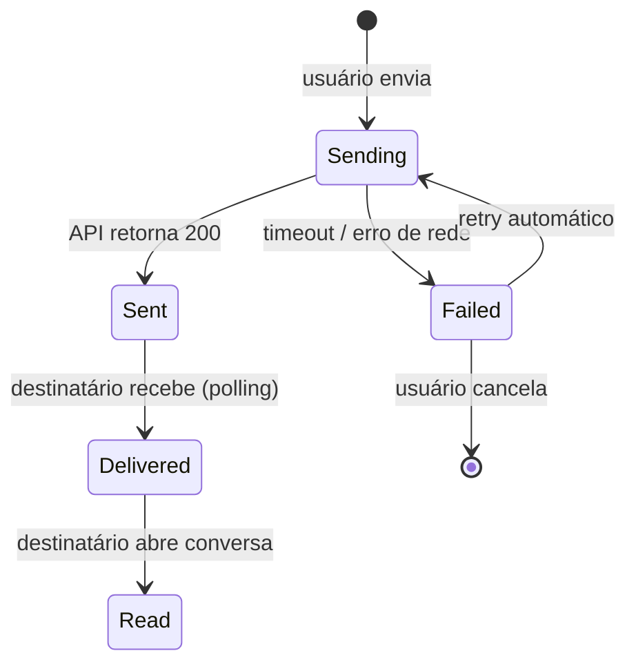
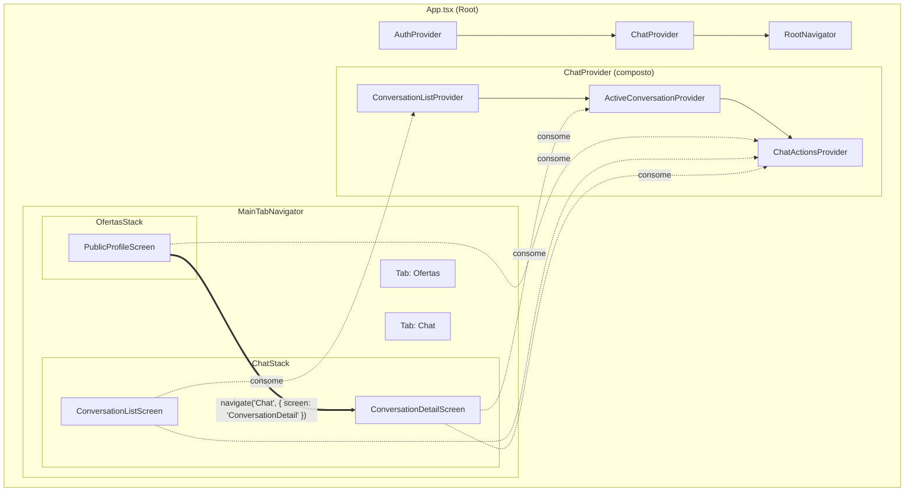

# Chat — Fase 1: Arquitetura de Estado com Abordagem Híbrida Pragmática

**Autor:** Equipe de Arquitetura — App Lite V2  
**Data:** 18 de março de 2026  
**Versão:** 1.0  
**Status:** Recomendação aprovada para implementação

---

## Sumário

1. [Contexto e Problema](#1-contexto-e-problema)
2. [Análise da Viabilidade — Fase 1](#2-análise-da-viabilidade--fase-1)
3. [Recomendação: Abordagem Híbrida Pragmática de Contexts](#3-recomendação-abordagem-híbrida-pragmática-de-contexts)
4. [Arquitetura de Contexts Proposta](#4-arquitetura-de-contexts-proposta)
5. [Navegação Cross-Tab (PublicProfile → ConversationScreen)](#5-navegação-cross-tab-publicprofile--conversationscreen)
6. [Diagramas Recomendados](#6-diagramas-recomendados)
7. [Prós e Contras — Múltiplos Contexts vs Context Único](#7-prós-e-contras--múltiplos-contexts-vs-context-único)
8. [Plano de Migração Futura](#8-plano-de-migração-futura)
9. [Exemplos de Código](#9-exemplos-de-código)

---

## 1. Contexto e Problema

O documento original da Fase 1 do Chat propõe usar um único `ChatContext.tsx` para gerenciar todo o estado do chat (conversas, mensagens, contadores de não-lidas, status de digitação, etc.).

### Problema identificado

A React Context API faz **re-render de todos os consumidores** quando **qualquer valor** do contexto muda. Em um chat com polling a cada 10 segundos, isso significa:

```
Polling atualiza mensagens de uma conversa
  → ChatContext.Provider recebe novo value
    → TODOS os componentes que usam useContext(ChatContext) re-renderizam
      → Lista de conversas re-renderiza (mesmo sem mudança)
      → Badge de contagem re-renderiza (mesmo sem mudança)
      → Tela de conversa atual re-renderiza (correto, mas pode ser otimizado)
```

**Impacto real:** Em um cenário com 20+ conversas e polling ativo, o app pode sofrer jank (quedas de FPS), especialmente em dispositivos Android de entrada.

---

## 2. Análise da Viabilidade — Fase 1

### ✅ O que a Fase 1 cobre adequadamente

| Aspecto | Avaliação |
|---------|-----------|
| Modelo de dados (Conversation, Message) | ✅ Bem definido |
| Endpoints REST (CRUD de conversas/mensagens) | ✅ Viável com a stack Express + MongoDB existente |
| Polling como estratégia inicial (sem WebSocket) | ✅ Pragmático para MVP |
| UI básica (lista de conversas + tela de mensagens) | ✅ Alinhado com react-native-paper |
| Autenticação/autorização | ✅ JWT existente cobre o caso |

### ⚠️ Pontos que merecem atenção

| Aspecto | Problema | Solução proposta neste documento |
|---------|----------|----------------------------------|
| Estado centralizado em 1 Context | Re-renders desnecessários | Abordagem Híbrida (múltiplos Contexts) |
| Navegação cross-tab | Não detalhada | Seção 5 deste documento |
| Performance com polling | Todos os consumidores atualizam | Separação State/Actions + `useMemo` |

---

## 3. Recomendação: Abordagem Híbrida Pragmática de Contexts

A recomendação é **separar o estado do chat em 3 Contexts especializados**, seguindo o padrão que o projeto já utiliza com sucesso no `ProfilePreviewContext` (separação State/Actions).

### Por que "Híbrida Pragmática"?

- **Híbrida:** Combina a simplicidade da Context API (já familiar à equipe) com técnicas de otimização que evitam os problemas de performance.
- **Pragmática:** Não introduz bibliotecas novas (Zustand, Redux Toolkit) na Fase 1, reduzindo risco e curva de aprendizado. A migração fica como opção futura, se necessário.

### Os 3 Contexts

```
ChatProvider (wrapper composto)
├── ConversationListContext    → Lista de conversas + contagem de não-lidas
├── ActiveConversationContext  → Mensagens da conversa aberta + paginação
└── ChatActionsContext         → Funções: enviar, marcar como lida, criar conversa (ESTÁVEL, nunca muda referência)
```

### Por que esta separação funciona

| Cenário | Context Único (problema) | 3 Contexts (solução) |
|---------|--------------------------|----------------------|
| Polling atualiza mensagens da conversa aberta | ❌ Re-renderiza lista de conversas, badge, e tela de mensagens | ✅ Só `ActiveConversationContext` muda → só a tela de mensagens re-renderiza |
| Nova mensagem chega em conversa não-aberta | ❌ Re-renderiza tudo | ✅ Só `ConversationListContext` muda → só a lista e o badge re-renderizam |
| Usuário envia mensagem | ❌ Re-renderiza tudo (incluindo lista e badge) | ✅ Ação via `ChatActionsContext` (referência estável via `useCallback`) → re-render mínimo |
| Navegar entre abas (Chat ↔ Ofertas) | ❌ Re-monta se context resetar | ✅ Context persiste no nível do `App.tsx`, estado preservado |

---

## 4. Arquitetura de Contexts Proposta

### 4.1. Diagrama de Componentes (Árvore de Providers)

```
App.tsx
└── AuthProvider                    (existente)
    └── ChatProvider                (NOVO — wrapper composto)
        ├── ConversationListProvider
        ├── ActiveConversationProvider
        └── ChatActionsProvider
            └── ProfilePreviewProvider  (existente)
                └── RootNavigator       (existente)
                    └── MainTabNavigator
                        ├── OfertasStack
                        │   └── PublicProfileScreen (consome ChatActionsContext)
                        ├── ChatStack (NOVO)
                        │   ├── ConversationListScreen (consome ConversationListContext)
                        │   └── ConversationDetailScreen (consome ActiveConversationContext + ChatActionsContext)
                        └── ... (Agenda, Comunidade, Perfil)
```

### 4.2. Interfaces TypeScript

```typescript
// types/chat.ts

/** Status de entrega/leitura de uma mensagem */
type MessageStatus = 'sending' | 'sent' | 'delivered' | 'read' | 'failed';

/** Uma mensagem individual dentro de uma conversa */
interface Message {
  _id: string;
  conversationId: string;
  senderId: string;
  content: string;
  type: 'text' | 'image' | 'video';
  attachmentUrl?: string;
  status: MessageStatus;
  createdAt: string;
  updatedAt: string;
}

/** Resumo de uma conversa para exibição na lista */
interface ConversationSummary {
  _id: string;
  participants: ParticipantInfo[];
  lastMessage: Pick<Message, 'content' | 'createdAt' | 'senderId'> | null;
  unreadCount: number;
  updatedAt: string;
}

/** Informações básicas de um participante */
interface ParticipantInfo {
  _id: string;
  nome: string;
  avatar?: string;
}

// ---------- Context Interfaces ----------

/** Estado da lista de conversas */
interface ConversationListState {
  conversations: ConversationSummary[];
  totalUnread: number;
  isLoading: boolean;
  error: string | null;
}

/** Estado da conversa ativa (aberta) */
interface ActiveConversationState {
  conversationId: string | null;
  messages: Message[];
  isLoading: boolean;
  hasMore: boolean;  // para paginação
  error: string | null;
}

/** Ações do chat — referências estáveis (useCallback) */
interface ChatActionsContextType {
  sendMessage: (conversationId: string, content: string) => Promise<void>;
  createConversation: (participantId: string) => Promise<string>;
  markAsRead: (conversationId: string) => Promise<void>;
  openConversation: (conversationId: string) => void;
  closeConversation: () => void;
  loadMoreMessages: () => Promise<void>;
  refreshConversations: () => Promise<void>;
}
```

### 4.3. Regra de Ouro — Quem consome o quê

| Componente/Tela | ConversationListContext | ActiveConversationContext | ChatActionsContext |
|-----------------|:-----------------------:|:------------------------:|:------------------:|
| `ChatBadge` (ícone da tab) | ✅ (`totalUnread`) | ❌ | ❌ |
| `ConversationListScreen` | ✅ | ❌ | ✅ (`openConversation`) |
| `ConversationDetailScreen` | ❌ | ✅ | ✅ (`sendMessage`, `markAsRead`) |
| `PublicProfileScreen` (botão "Enviar Mensagem") | ❌ | ❌ | ✅ (`createConversation`) |
| `MessageComposer` (input de texto) | ❌ | ❌ | ✅ (`sendMessage`) |
| `MessageBubble` | ❌ | ❌ | ❌ (renderiza com props) |

---

## 5. Navegação Cross-Tab (PublicProfile → ConversationScreen)

### Problema

`PublicProfileScreen` está dentro do `OfertasStack` (tab "Ofertas"). `ConversationDetailScreen` estará no `ChatStack` (tab "Chat"). Navegar entre tabs requer **navegação cross-tab**.

### Solução com React Navigation

```typescript
// Dentro de PublicProfileScreen.tsx
// Após criar a conversa via ChatActionsContext:

const handleStartConversation = async () => {
  const conversationId = await createConversation(userId);
  
  // Navegação cross-tab: vai para a tab Chat e depois para a tela de detalhe
  navigation.navigate('Chat', {
    screen: 'ConversationDetail',
    params: {
      conversationId,
      participant: {
        _id: prestador.id,
        nome: prestador.nome,
        avatar: prestador.avatar,
      },
    },
  });
};
```

### Atualização necessária nos tipos de navegação

```typescript
// types/navigation.ts — Atualizações para Fase 1

export type ChatStackParamList = {
  ConversationList: undefined;
  ConversationDetail: {
    conversationId: string;
    participant: ParticipantInfo;
  };
};

export type MainTabParamList = {
  Ofertas: NavigatorScreenParams<OfertasStackParamList>;
  Agenda: undefined;
  Chat: NavigatorScreenParams<ChatStackParamList>;  // ← MUDANÇA: era `undefined`
  Comunidade: undefined;
  Perfil: NavigatorScreenParams<ProfileStackParamList>;
};
```

### Diagrama de Sequência — Fluxo de Navegação Cross-Tab

```
┌─────────────┐    ┌──────────────┐    ┌───────────────┐    ┌─────────────────────┐
│ PublicProfile│    │ChatActions   │    │ API Backend   │    │ConversationDetail   │
│   Screen     │    │  Context     │    │               │    │     Screen          │
└──────┬───────┘    └──────┬───────┘    └───────┬───────┘    └──────────┬──────────┘
       │                   │                    │                       │
       │ createConversation│                    │                       │
       │──────────────────>│                    │                       │
       │                   │ POST /chat/conv    │                       │
       │                   │───────────────────>│                       │
       │                   │   { conversationId }                      │
       │                   │<───────────────────│                       │
       │ conversationId    │                    │                       │
       │<──────────────────│                    │                       │
       │                   │                    │                       │
       │ navigation.navigate('Chat', {         │                       │
       │   screen: 'ConversationDetail',       │                       │
       │   params: { conversationId, ... }     │                       │
       │ })                │                    │                       │
       │───────────────────────────────────────────────────────────────>│
       │                   │                    │                       │
       │                   │                    │          openConversation(id)
       │                   │                    │                       │──┐
       │                   │                    │                       │  │ carrega
       │                   │                    │                       │  │ mensagens
       │                   │                    │                       │<─┘
```

---

## 6. Diagramas Recomendados

Para documentar e visualizar a arquitetura do chat, os seguintes diagramas UML/técnicos são recomendados:

### 6.1. Para Entender a Estrutura

| Diagrama | O que mostra | Ferramenta sugerida |
|----------|-------------|---------------------|
| **Diagrama de Componentes** (UML) | Hierarquia de Providers/Contexts e quais telas consomem qual Context | Mermaid, draw.io, Excalidraw |
| **Diagrama de Pacotes** (UML) | Organização de arquivos: `context/`, `screens/Chat/`, `services/`, `types/` | draw.io |

### 6.2. Para Entender o Comportamento (Fluxos)

| Diagrama | O que mostra | Quando usar |
|----------|-------------|-------------|
| **Diagrama de Sequência** (UML) | Fluxo temporal: Usuário clica "Enviar Mensagem" → Context → API → Tela atualiza | Fluxos cross-tab, polling, envio de mensagem |
| **Diagrama de Estados** (UML / Statechart) | Estados de uma mensagem: `sending → sent → delivered → read → failed` | Ciclo de vida de mensagens |
| **Flowchart** | Decisões: "Conversa existe? → Sim: abre / Não: cria nova" | Lógica de criação de conversa |

### 6.3. Para Visualizar a Navegação

| Diagrama | O que mostra | Observação |
|----------|-------------|------------|
| **Diagrama de Navegação** (custom) | Mapa de telas com setas indicando fluxos de navegação, incluindo cross-tab | Específico para React Navigation |
| **Wireflow** | Wireframes conectados por setas de fluxo | Combina UI + navegação |

### 6.4. Exemplo — Diagrama de Estados de uma Mensagem (Mermaid)



### 6.5. Exemplo — Diagrama de Componentes do Chat (Mermaid)



---

## 7. Prós e Contras — Múltiplos Contexts vs Context Único

### 7.1. Context Único (`ChatContext`)

| Prós | Contras |
|------|---------|
| ✅ Simples de implementar (1 arquivo) | ❌ **Re-render global** a cada polling (10s) |
| ✅ Um único `useChat()` hook | ❌ Performance degrada com mais conversas |
| ✅ Fácil de entender para devs júnior | ❌ Difícil de otimizar depois (refactor pesado) |
| ✅ Menos boilerplate | ❌ `useMemo` / `React.memo` não resolvem (o Provider value muda) |

### 7.2. Múltiplos Contexts (3 Contexts especializados) — **Recomendado**

| Prós | Contras |
|------|---------|
| ✅ **Re-renders cirúrgicos** — só atualiza quem precisa | ❌ Mais boilerplate (3 arquivos de context ou 1 arquivo maior) |
| ✅ **ChatActionsContext nunca muda referência** → componentes que só usam ações nunca re-renderizam | ❌ Dev precisa saber qual hook usar (`useConversationList` vs `useActiveConversation` vs `useChatActions`) |
| ✅ Alinhado com o padrão do projeto (`ProfilePreviewContext` já separa State/Actions) | ❌ Coordenação entre contexts exige cuidado (shared state via refs) |
| ✅ Polling a cada 10s não impacta componentes que não consomem aquele Context | ❌ Debug um pouco mais complexo (React DevTools mostra 3 providers) |
| ✅ **Facilita migração futura** — cada Context pode virar um slice de Zustand/Redux sem mudar consumidores | ❌ Provider nesting (resolvido pelo ChatProvider wrapper) |
| ✅ Separação de responsabilidades clara (SRP) | |
| ✅ Testes unitários mais isolados | |

### 7.3. Veredicto

Para um **MVP com polling**, a diferença de performance entre 1 e 3 Contexts é **significativa**. O custo de boilerplate adicional é **baixo** (≈50 linhas extras) e paga-se em:
- Menos bugs de performance em produção
- Path de migração limpo para Zustand/Redux
- Padrão consistente com o que já existe no projeto

---

## 8. Plano de Migração Futura

A abordagem híbrida foi projetada para ser **migração-friendly**:

```
Fase 1 (MVP)           → 3 React Contexts + polling HTTP
Fase 2 (Otimização)    → Substituir polling por WebSocket (Socket.io)
Fase 3 (Escala)        → Migrar Contexts para Zustand ou Redux Toolkit (slices)
```

### Como a migração funciona

1. **Os hooks públicos permanecem idênticos**: `useConversationList()`, `useActiveConversation()`, `useChatActions()`
2. **Apenas a implementação interna muda** (de Context para Zustand store)
3. **Nenhuma tela precisa ser refatorada** — os componentes continuam consumindo os mesmos hooks

```typescript
// Fase 1 — Context
export const useConversationList = (): ConversationListState => {
  const context = useContext(ConversationListContext);
  if (!context) throw new Error('...');
  return context;
};

// Fase 3 — Zustand (mesma interface, diferente implementação)
export const useConversationList = (): ConversationListState => {
  return useChatStore(state => ({
    conversations: state.conversations,
    totalUnread: state.totalUnread,
    isLoading: state.isLoading,
    error: state.error,
  }));
};
```

---

## 9. Exemplos de Código

### 9.1. ChatProvider Composto (wrapper)

```typescript
// context/chat/ChatProvider.tsx

import React, { ReactNode } from 'react';
import { ConversationListProvider } from './ConversationListContext';
import { ActiveConversationProvider } from './ActiveConversationContext';
import { ChatActionsProvider } from './ChatActionsContext';

interface ChatProviderProps {
  children: ReactNode;
}

/**
 * Provider composto que encapsula os 3 contexts do chat.
 * Montado em App.tsx, acima do RootNavigator.
 * O order de nesting importa: Actions depende de ConversationList e ActiveConversation.
 */
export const ChatProvider: React.FC<ChatProviderProps> = ({ children }) => {
  return (
    <ConversationListProvider>
      <ActiveConversationProvider>
        <ChatActionsProvider>
          {children}
        </ChatActionsProvider>
      </ActiveConversationProvider>
    </ConversationListProvider>
  );
};
```

### 9.2. ConversationListContext (estado da lista)

```typescript
// context/chat/ConversationListContext.tsx

import React, { createContext, useContext, useState, useEffect, useCallback, useRef, ReactNode } from 'react';
import { AppState, AppStateStatus } from 'react-native';
import { chatService } from '@/services/chatService';
import { useAuth } from '@/context/AuthContext';

const POLLING_INTERVAL = 10_000; // 10 segundos

interface ConversationListState {
  conversations: ConversationSummary[];
  totalUnread: number;
  isLoading: boolean;
  error: string | null;
}

const ConversationListContext = createContext<ConversationListState | undefined>(undefined);

export const ConversationListProvider: React.FC<{ children: ReactNode }> = ({ children }) => {
  const { isAuthenticated } = useAuth();
  const [state, setState] = useState<ConversationListState>({
    conversations: [],
    totalUnread: 0,
    isLoading: false,
    error: null,
  });
  const intervalRef = useRef<ReturnType<typeof setInterval> | null>(null);

  const fetchConversations = useCallback(async () => {
    if (!isAuthenticated) return;
    try {
      const data = await chatService.getConversations();
      const totalUnread = data.reduce((sum, c) => sum + c.unreadCount, 0);
      setState({ conversations: data, totalUnread, isLoading: false, error: null });
    } catch (err) {
      setState(prev => ({ ...prev, error: 'Erro ao carregar conversas', isLoading: false }));
    }
  }, [isAuthenticated]);

  // Inicia/para polling baseado no estado de autenticação e AppState
  useEffect(() => {
    if (!isAuthenticated) return;

    void fetchConversations();
    intervalRef.current = setInterval(fetchConversations, POLLING_INTERVAL);

    const handleAppState = (nextState: AppStateStatus) => {
      if (nextState === 'active') {
        void fetchConversations();
        if (!intervalRef.current) {
          intervalRef.current = setInterval(fetchConversations, POLLING_INTERVAL);
        }
      } else {
        if (intervalRef.current) {
          clearInterval(intervalRef.current);
          intervalRef.current = null;
        }
      }
    };

    const subscription = AppState.addEventListener('change', handleAppState);

    return () => {
      if (intervalRef.current) clearInterval(intervalRef.current);
      subscription.remove();
    };
  }, [isAuthenticated, fetchConversations]);

  return (
    <ConversationListContext.Provider value={state}>
      {children}
    </ConversationListContext.Provider>
  );
};

export const useConversationList = (): ConversationListState => {
  const context = useContext(ConversationListContext);
  if (!context) throw new Error('useConversationList deve ser usado dentro de ChatProvider');
  return context;
};
```

### 9.3. ChatActionsContext (ações estáveis)

```typescript
// context/chat/ChatActionsContext.tsx

import React, { createContext, useContext, useCallback, useMemo, ReactNode } from 'react';
import { chatService } from '@/services/chatService';

interface ChatActionsContextType {
  sendMessage: (conversationId: string, content: string) => Promise<void>;
  createConversation: (participantId: string) => Promise<string>;
  markAsRead: (conversationId: string) => Promise<void>;
  openConversation: (conversationId: string) => void;
  closeConversation: () => void;
  loadMoreMessages: () => Promise<void>;
  refreshConversations: () => Promise<void>;
}

const ChatActionsContext = createContext<ChatActionsContextType | undefined>(undefined);

export const ChatActionsProvider: React.FC<{ children: ReactNode }> = ({ children }) => {
  // Todas as ações são useCallback com deps estáveis → referência nunca muda
  const sendMessage = useCallback(async (conversationId: string, content: string) => {
    await chatService.sendMessage(conversationId, content);
  }, []);

  const createConversation = useCallback(async (participantId: string): Promise<string> => {
    const conversation = await chatService.createConversation(participantId);
    return conversation._id;
  }, []);

  const markAsRead = useCallback(async (conversationId: string) => {
    await chatService.markAsRead(conversationId);
  }, []);

  // ... demais ações com useCallback

  const value = useMemo<ChatActionsContextType>(() => ({
    sendMessage,
    createConversation,
    markAsRead,
    openConversation: () => {}, // implementação real conecta com ActiveConversationContext
    closeConversation: () => {},
    loadMoreMessages: async () => {},
    refreshConversations: async () => {},
  }), [sendMessage, createConversation, markAsRead]);

  return (
    <ChatActionsContext.Provider value={value}>
      {children}
    </ChatActionsContext.Provider>
  );
};

export const useChatActions = (): ChatActionsContextType => {
  const context = useContext(ChatActionsContext);
  if (!context) throw new Error('useChatActions deve ser usado dentro de ChatProvider');
  return context;
};
```

### 9.4. Uso em PublicProfileScreen (navegação cross-tab)

```typescript
// Dentro de PublicProfileScreen.tsx — Botão "Enviar Mensagem"

import { useChatActions } from '@/context/chat/ChatActionsContext';

const PublicProfileScreen: React.FC<Props> = ({ route, navigation }) => {
  const { userId, prestador } = route.params;
  const { createConversation } = useChatActions();
  const [isSending, setIsSending] = useState(false);

  const handleStartConversation = async () => {
    try {
      setIsSending(true);
      const conversationId = await createConversation(userId);

      // Navegação cross-tab: Ofertas → Chat
      navigation.navigate('Chat', {
        screen: 'ConversationDetail',
        params: {
          conversationId,
          participant: {
            _id: prestador.id,
            nome: prestador.nome,
            avatar: prestador.avatar,
          },
        },
      });
    } catch (error) {
      // Toast de erro
    } finally {
      setIsSending(false);
    }
  };

  return (
    // ... UI existente ...
    <Button
      mode="contained"
      onPress={handleStartConversation}
      loading={isSending}
      icon="chat"
      accessibilityLabel={`Enviar mensagem para ${prestador.nome}`}
    >
      Enviar Mensagem
    </Button>
  );
};
```

---

## Estrutura de Arquivos Recomendada — Fase 1

```
packages/mobile/src/
├── context/
│   ├── AuthContext.tsx                 (existente)
│   ├── ProfilePreviewContext.tsx       (existente)
│   ├── SwiperIndexContext.tsx          (existente)
│   └── chat/                          (NOVO)
│       ├── ChatProvider.tsx            ← wrapper composto
│       ├── ConversationListContext.tsx  ← estado da lista
│       ├── ActiveConversationContext.tsx ← estado da conversa aberta
│       └── ChatActionsContext.tsx       ← ações estáveis
├── screens/
│   └── app/
│       └── Chat/                       (NOVO)
│           ├── ConversationListScreen.tsx
│           └── ConversationDetailScreen.tsx
├── services/
│   └── chatService.ts                  (NOVO)
├── types/
│   └── chat.ts                         (NOVO)
└── navigation/
    └── MainTabNavigator.tsx            (ATUALIZAR — ChatStack)
```

---

## Checklist de Implementação — Fase 1

- [ ] Criar `types/chat.ts` com interfaces de Message, Conversation, etc.
- [ ] Criar `services/chatService.ts` com chamadas REST
- [ ] Criar `context/chat/ConversationListContext.tsx`
- [ ] Criar `context/chat/ActiveConversationContext.tsx`
- [ ] Criar `context/chat/ChatActionsContext.tsx`
- [ ] Criar `context/chat/ChatProvider.tsx` (wrapper composto)
- [ ] Montar `ChatProvider` em `App.tsx`
- [ ] Criar `ChatStackNavigator` no `MainTabNavigator.tsx`
- [ ] Atualizar `MainTabParamList` com `ChatStackParamList`
- [ ] Criar `ConversationListScreen.tsx`
- [ ] Criar `ConversationDetailScreen.tsx`
- [ ] Adicionar botão "Enviar Mensagem" no `PublicProfileScreen`
- [ ] Implementar endpoints REST no backend (`/chat/*`)
- [ ] Criar modelo MongoDB `Conversation` e `Message`
- [ ] Testes unitários (cobertura mínima 80%)

---

*Documento gerado como referência arquitetural para a Fase 1 do Chat. Revisões futuras devem atualizar este documento conforme a implementação evolui.*

